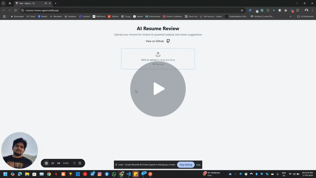

# Resume Review AI Agent

 React application for reviewing resumes and providing career advice with Ollama Server.

---

## DEMO: 
<a href="https://www.loom.com/share/9b2bc75400044a5c8990a27db9a53411?sid=9068aca8-bd50-40f7-ab52-6bab44249042" target="_blank">
Video Demo Link

</a>

---

## Dev Setup (V1 - Ollama)
- Clone the repo
- Run `npm install`
- Run `npm run dev`
- Make sure Ollama is running, open `http://localhost:11434/`
- Or you can use hosted Ollama server, by passing the host url in `src/utils/ollamaClient.ts`
- Pull Ollama model `llama3.2:1b`
- Open `http://localhost:5173/` in your browser
- Upload your resume and get analysis

## Dev Setup (V2 - Groq)
- Clone the repo
- Run `npm install`
- Run `npm run dev`
- Add API key(VITE_GROQ_API_KEY) to `.env` file
- Open `http://localhost:5173/` in your browser
- Upload your resume and get analysis

---

## Tech Stack(V1 - Ollama)
- React
- Ollama Server
- `pdfjs-dist` for parsing the file.
- `ollama` package for interacting with Ollama Server.
- `tailwindcss` for styling.
- `lucide-react` for icons.

## Tech Stack(V2 - Groq)
- React
- `pdfjs-dist` for parsing the file.
- `groq-sdk` for interacting with Groq Server.
- `tailwindcss` for styling.
- `lucide-react` for icons.

---

## Further Enhancements
- Allow user to chat with the agent
- Allow multiple Resumes to be uploaded and compared
- Ideally the Groq API should be in NextJs API or backend server instead of client handling the API key. 

